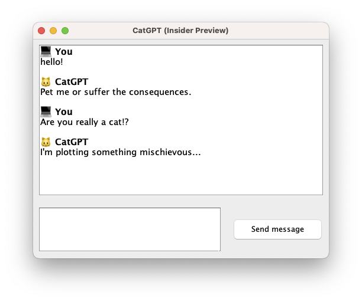

# CatGPT

Java based program simulating a cat LLM named "CatGPT".



## Build

No additional build conditions are required; simply compile and run it.

```shell
javac CatGPT.java && java CatGPT
```

## License

License under [MIT](./LICENSE)
